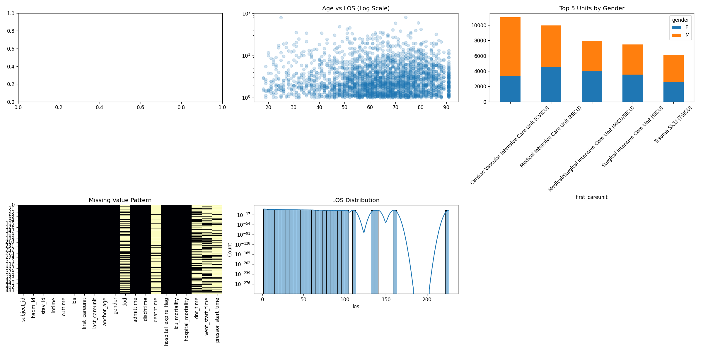

# MIMIC-IV Cohort Exploratory Data Analysis Report

**Analysis Date:** 2026-01-09 22:00:13

---

## 1. Dataset Basic Information

- **Total Records:** 54,551
- **Unique Patients:** 54,551
- **Number of Features:** 20

### Column Names and Data Types

```
subject_id                : int64
hadm_id                   : int64
stay_id                   : int64
intime                    : object
outtime                   : object
los                       : float64
first_careunit            : object
last_careunit             : object
anchor_age                : int64
gender                    : object
dod                       : object
admittime                 : object
dischtime                 : object
deathtime                 : object
hospital_expire_flag      : int64
icu_mortality             : int64
hospital_mortality        : int64
dnr_time                  : object
vent_start_time           : object
pressor_start_time        : object
```

본 코호트는 54,551개의 ICU 입실(stay)으로 구성되며, 환자 수와 record 수가 동일하다.
이는 본 데이터가 환자당 1개의 ICU stay만 포함하도록 이미 정제된 코호트임을 의미한다.

이러한 구조는 이후 조기 사망 예측이나 중재 필요 알림과 같이 시간에 따라 상태가 변화하는 문제를 다루기 위해서 슬라이딩 윈도우 적용 시
각 stay를 기준으로 시간 축 방향으로 샘플을 확장하기에 적합하다.

총 20개의 변수는 인구학적 정보, 입실·퇴실 시점, 사망 여부,
그리고 주요 중재 이벤트 시작 시점을 포함하고 있으며,
조기 악화 예측을 위한 메타 코호트 테이블로서 충분한 정보를 제공한다.

## 2. Descriptive Statistics

### Numerical Variables

```
         subject_id       hadm_id       stay_id           los    anchor_age  hospital_expire_flag  icu_mortality  hospital_mortality
count  5.455100e+04  5.455100e+04  5.455100e+04  54551.000000  54551.000000          54551.000000   54551.000000        54551.000000
mean   1.500495e+07  2.498014e+07  3.497754e+07      4.254281     63.798116              0.107807       0.070338            0.107807
std    2.891260e+06  2.883410e+06  2.892244e+06      5.689087     16.607906              0.310140       0.255718            0.310140
min    1.000069e+07  2.000015e+07  3.000015e+07      1.000000     18.000000              0.000000       0.000000            0.000000
25%    1.250780e+07  2.248656e+07  3.246635e+07      1.539288     54.000000              0.000000       0.000000            0.000000
50%    1.500952e+07  2.496850e+07  3.496116e+07      2.373958     65.000000              0.000000       0.000000            0.000000
75%    1.752550e+07  2.746583e+07  3.747288e+07      4.461140     76.000000              0.000000       0.000000            0.000000
max    1.999999e+07  2.999983e+07  3.999986e+07    226.403079     91.000000              1.000000       1.000000            1.000000
```

중앙 연령은 65세, 중앙 LOS는 2.37일로,
대부분의 환자는 비교적 짧은 ICU 재실 기간을 가지지만
일부 장기 입원 환자가 평균 LOS를 크게 증가시키는 우측 편향 분포를 보인다.

사망 관련 지표를 보면 hospital mortality는 약 10.8%로
조기 사망 예측 문제에서 명확한 class imbalance가 존재함을 확인할 수 있다.
이는 이후 모델링 단계에서 PR-AUC, recall 중심 평가가 필요함을 시사한다.

전처리 관점에서 LOS는 feature로 직접 사용하지 않되,
슬라이딩 윈도우 생성 시 샘플 수를 제어하는 기준 변수로 활용하는 것이 적절하다.

### Key Metrics

- **Average hospital stays per patient:** 1.00
- **Median age:** 65.0 years
- **Median LOS:** 2.37 days

## 3. Missing Values Analysis

| Column             | Missing Count | Percentage |
| ------------------ | ------------- | ---------- |
| dod                | 35,749        | 65.53%     |
| deathtime          | 48,677        | 89.23%     |
| dnr_time           | 28,922        | 53.02%     |
| vent_start_time    | 31,631        | 57.98%     |
| pressor_start_time | 42,873        | 78.59%     |

사망 시점(deathtime, dod)과 중재 시작 시점(vent_start_time, pressor_start_time)에서
높은 결측률이 관찰되지만, 이는 데이터 품질 문제라기보다
사망 또는 중재가 발생하지 않은 환자가 다수 존재하기 때문인 구조적 결측이다.

특히 vent_start_time, pressor_start_time의 높은 결측률은
해당 중재가 모든 환자에게 적용되지 않는 이벤트 기반 변수임을 의미한다.

따라서 이들 변수는 단순 결측 보간 대상이 아니라,
이벤트 발생 여부 및 시점 정보로 재해석되어야 한다.

따라서 전처리 단계에서는 다음과 같은 방향이 제시될 수 있다.

- 사망 시점 변수 → label 생성 전용

- 중재 시점 변수 → 이벤트 발생 여부 + 시점 기반 feature

- 결측 자체를 “미발생” 상태로 해석

이는 이후 중재 필요 알림(ventilator/pressor) 예측을 위한 핵심 전처리 설계로 이어질 수 있다.

## 4. Categorical Variables Analysis

### Gender Distribution

| Gender | Count  | Percentage |
| ------ | ------ | ---------- |
| M      | 31,056 | 56.93%     |
| F      | 23,495 | 43.07%     |

### ICU Unit Distribution

| ICU Unit                                 | Count  | Percentage |
| ---------------------------------------- | ------ | ---------- |
| Cardiac Vascular Intensive Care Unit (CV | 11,008 | 20.18%     |
| Medical Intensive Care Unit (MICU)       | 9,942  | 18.23%     |
| Medical/Surgical Intensive Care Unit (MI | 7,957  | 14.59%     |
| Surgical Intensive Care Unit (SICU)      | 7,458  | 13.67%     |
| Trauma SICU (TSICU)                      | 6,149  | 11.27%     |
| Coronary Care Unit (CCU)                 | 6,059  | 11.11%     |
| Neuro Intermediate                       | 3,779  | 6.93%      |
| Neuro Surgical Intensive Care Unit (Neur | 1,130  | 2.07%      |
| Neuro Stepdown                           | 865    | 1.59%      |
| Surgery/Vascular/Intermediate            | 102    | 0.19%      |

성별 분포는 비교적 균형을 이루고 있으며,남성(56.9%)이 여성(43.1%)보다 다소 높은 비율을 보인다.

ICU unit 분포를 보면,
MICU, SICU, CVICU 등 주요 중환자실 유형이 고르게 포함되어 있어
특정 유닛에 치우치지 않은 다양한 임상 환경을 반영한 코호트임을 확인할 수 있다.
(범용적인 ICU 조기 악화 신호를 학습할 가능성이 있다)

이는 모델 학습 시 유닛 특이적 편향을 완화하는 데 유리하다.

## 5. Numerical Variables Analysis

### Age Distribution

| Age Group | Count  | Percentage |
| --------- | ------ | ---------- |
| <30       | 2,619  | 4.80%      |
| 30-50     | 8,162  | 14.96%     |
| 50-65     | 16,534 | 30.31%     |
| 65-80     | 18,171 | 33.31%     |
| 80+       | 9,065  | 16.62%     |

### Length of Stay (LOS) Distribution

- 25th percentile: 1.54 days
- 50th percentile: 2.37 days
- 75th percentile: 4.46 days
- 90th percentile: 8.99 days
- 95th percentile: 13.89 days
- 99th percentile: 28.09 days

연령 분포를 보면 50세 이상 환자가 전체의 약 80% 이상을 차지하며,
특히 65–80세 구간이 가장 높은 비중을 보인다.

LOS 분포 분석 결과,
75%의 환자가 4.5일 이내에 ICU를 퇴실하지만
상위 1%는 28일 이상 재실하는 극단값을 보인다.

이는 슬라이딩 윈도우 적용 시
관찰 기간 상한을 제한하지 않으면 샘플 수 불균형이 발생할 수 있음을 시사한다.

## 6. Correlation Analysis

```
            anchor_age     los
anchor_age      1.0000 -0.0371
los            -0.0371  1.0000
```

연령과 LOS 간 상관계수는 -0.037로 거의 0에 가까우며,
이는 고령일수록 반드시 ICU 재실 기간이 길어지는 것은 아님을 의미한다.

따라서 LOS는 단순히 연령의 대리 변수로 해석할 수 없으며,
임상 경과 및 중재 이벤트를 함께 고려해야 하는 복합적인 결과 변수임을 시사한다.
즉, 단일 정적 변수 조합만으로는
사망 위험이나 중재 필요성을 설명하기 어렵다는 점을 시사하며,
시간에 따른 생리 신호 변화와 이벤트 발생 정보가 중요함을 뒷받침한다.

즉, 이 결과는
정적 로지스틱 모델보다는
시간 상태 기반(sliding window) 모델 설계의 필요성을 간접적으로 보여준다.

## 8. Sliding Window & Clipping Decision EDA

LOS 및 사망 시점 분포를 통해 시간 기반(sliding window) 분석의 필요성을 확인하였다.

### LOS Distribution

- 90th percentile: 8.99
- 95th percentile: 13.89
- 99th percentile: 28.09

LOS 분포 및 슬라이딩 윈도우 전처리 전략에 대한 종합 해석

ICU 재실 기간(LOS)은 본질적으로 우측으로 긴 꼬리를 가지는 분포를 보이며, 대부분의 환자는 1–3일 내에 ICU를 퇴실하지만 일부 중증 환자는 다장기 부전, 반복적 중재, 합병증 또는 회복 지연으로 인해 수 주 이상 장기간 재실하게 된다. 이러한 소수의 장기 재실 환자들이 LOS 분포의 상위 백분위수(90–99%)를 크게 증가시키며, 그 결과 중앙값은 비교적 짧지만 95th 및 99th percentile에서는 급격한 확장이 관찰되는 전형적인 ICU LOS 특성이 나타난다. 본 데이터에서도 전체 환자의 약 90%는 9일 이내에 ICU를 퇴실하는 반면, 극소수 환자가 2–4주 이상 재실함으로써 LOS 분포의 긴 꼬리를 형성하고 있다.

다만 LOS는 환자의 퇴실 이후에야 확정되는 미래 정보이므로 예측 모델의 입력 feature로 사용하는 것은 데이터 누수를 유발할 수 있으며, 대신 슬라이딩 윈도우 기반 전처리 과정에서 구조적 제어 변수로 활용하는 것이 타당하다. 즉, LOS는 예측에 직접 사용되기보다는 데이터 생성 과정의 안정성을 확보하기 위한 기준으로 해석된다.

특히 슬라이딩 윈도우를 적용할 경우, ICU 재실 기간이 긴 환자일수록 시간 단위 샘플 수가 기하급수적으로 증가하여 일부 장기 재실 환자가 학습 데이터의 대부분을 차지하는 문제가 발생할 수 있다. 이는 모델이 소수 환자의 패턴에 과도하게 적응하거나 계산 복잡도가 불필요하게 증가하는 원인이 된다.

이에 본 프로젝트에서는 환자를 분석 대상에서 제외하지 않고, 슬라이딩 윈도우 생성 단계에서만 최대 관찰 기간에 상한을 두어 환자별 평가 시점 수를 제한하는 방식을 채택한다. 이를 통해 장기 재실 환자의 정보는 유지하면서도, 데이터 불균형과 과도한 샘플 증식을 효과적으로 제어한다.

또한 LOS 및 사망 시점 분포를 종합하면 사망 위험은 ICU 입실 후 특정 시점에 고정되지 않고 재실 기간 전반에 걸쳐 발생하는 동적 특성을 보인다. 이는 입실 시 한 번만 위험을 예측하는 정적 접근보다는, 현재 시점 기준으로 향후 위험을 반복적으로 평가하는 구조가 임상적으로 더 적절함을 의미한다.

따라서 본 프로젝트에서는 1시간 단위 stride와 과거 6시간 관찰 window를 기반으로 한 슬라이딩 윈도우 전처리를 적용하며, LOS는 윈도우 생성 단계에서만 상한을 두는 방식으로 관리한다. 이러한 전처리 전략은 조기 사망 예측 및 중재 필요 알림이라는 문제 정의에 부합하며, ICU 입실 초기의 위험 신호에 집중하면서도 데이터 불균형과 계산 복잡도를 동시에 완화하기 위한 합리적인 설계 선택이다.

## 7. Key Visualizations

1. Patient Admissions by Hour
2. Age vs LOS
3. ICU Unit Statistics
4. Missing Value Heatmap


