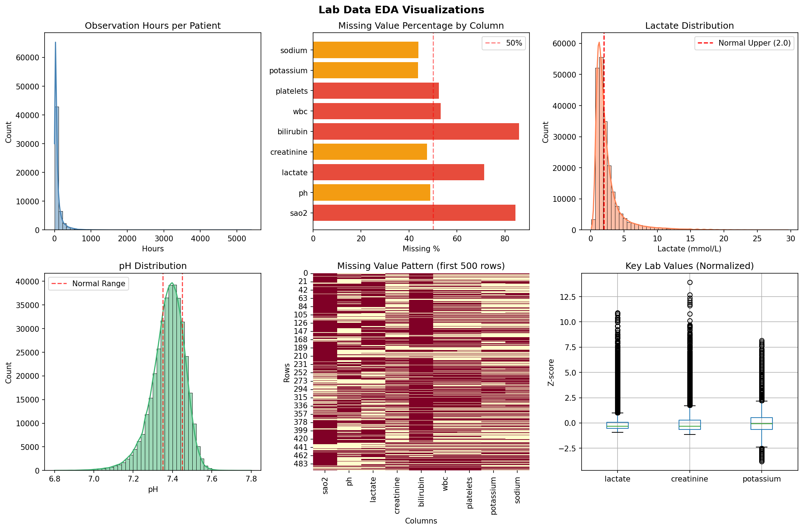

# MIMIC-IV Lab Data EDA Report

**Analysis Date:** 2026-01-10 19:05:38

---

## 1. Dataset Basic Information

- **Total Records:** 739,339
- **Unique Patients (stay_id):** 54,278
- **Number of Features:** 12

### Column Names and Data Types

```
stay_id                 int64
charttime_h    datetime64[ns]
sao2                  float64
ph                    float64
lactate               float64
creatinine            float64
bilirubin             float64
wbc                   float64
platelets             float64
potassium             float64
sodium                float64
is_missing               bool
```

본 Lab 데이터는 739,339개의 시간별 검사 기록으로 구성되며, 
54,278명의 ICU 환자에 대한 혈액검사 결과를 포함한다.

## 2. Descriptive Statistics

### Numerical Variables

```
            sao2         ph    lactate  creatinine  bilirubin        wbc  platelets  potassium     sodium
count  115733.00  378677.00  212458.00   387864.00  104366.00  345767.00  351973.00  415893.00  414510.00
mean       85.87       7.37       2.52        1.50       3.25      12.64     196.98       4.12     139.26
std        14.94       0.09       2.39        1.45       6.12       7.48     122.88       0.63       5.95
min        50.00       6.80       0.10        0.10       0.10       0.10       5.00       1.50     110.00
25%        73.00       7.33       1.20        0.70       0.50       8.10     113.00       3.70     136.00
50%        94.00       7.38       1.80        1.00       0.90      11.10     174.00       4.00     139.00
75%        97.00       7.43       2.80        1.70       2.80      15.30     252.00       4.40     142.00
max       100.00       7.80      29.60       24.70      50.00      99.80    1000.00      10.00     170.00
```

주요 검사 지표들의 분포를 보면:
- **Lactate**: 평균 2.52 mmol/L (정상: <2.0)
- **Creatinine**: 평균 1.50 mg/dL
- **pH**: 평균 7.37 (정상: 7.35-7.45)
- **Platelets**: 평균 197 K/uL

## 3. Missing Values Analysis

| Column | Missing Count | Percentage |
|--------|---------------|------------|
| sao2 | 623,606 | 84.35% |
| ph | 360,662 | 48.78% |
| lactate | 526,881 | 71.26% |
| creatinine | 351,475 | 47.54% |
| bilirubin | 634,973 | 85.88% |
| wbc | 393,572 | 53.23% |
| platelets | 387,366 | 52.39% |
| potassium | 323,446 | 43.75% |
| sodium | 324,829 | 43.94% |

### 결측 패턴 해석

Lab 데이터의 결측은 크게 두 가지 원인으로 구분된다:

1. **검사 미시행**: 임상적으로 해당 검사가 필요하지 않았던 경우
2. **시간대별 측정 주기 차이**: Lab 검사는 vitals와 달리 연속 모니터링이 아닌 의사 오더 기반

특히 **sao2 (동맥혈 산소포화도)**와 **bilirubin**의 높은 결측률은 
ABGA나 간기능 검사가 모든 환자에게 routine으로 시행되지 않음을 반영한다.

결측 자체가 "검사 불필요" 또는 "안정적 상태"를 의미할 수 있으므로,
`lactate_missing`, `abga_checked` 같은 플래그 변수로 정보를 보존하는 전략이 적절하다.

## 4. Temporal Coverage Analysis

### 환자별 Lab 데이터 시간 범위

- **평균 관찰 시간:** 86.2시간
- **중앙값 관찰 시간:** 44.0시간

### 24시간 미만 데이터 보유 환자

- **해당 환자 수:** 12,918명 (23.8%)
- 이는 Lab 검사 자체의 특성(비연속적, 오더 기반)으로 인한 것으로,
  vitals 데이터와 병합 시 Lab 값은 forward-fill 등의 전략으로 보간 처리 필요

## 5. Clinical Reference Ranges

| 검사 항목 | 정상 범위 | 단위 | 임상적 의의 |
|----------|----------|------|------------|
| pH | 7.35-7.45 | - | 산-염기 균형 |
| Lactate | <2.0 | mmol/L | 조직 관류 상태 |
| Creatinine | 0.7-1.3 (M), 0.6-1.1 (F) | mg/dL | 신기능 |
| WBC | 4.5-11.0 | K/uL | 감염/염증 |
| Platelets | 150-400 | K/uL | 응고 기능 |
| Potassium | 3.5-5.0 | mEq/L | 전해질 |
| Sodium | 136-145 | mEq/L | 전해질 |
| Bilirubin | 0.1-1.2 | mg/dL | 간기능 |

## 6. Preprocessing Recommendations

### 전처리 전략

| 변수 | 결측률 | 권장 전략 | 근거 |
|------|--------|----------|------|
| creatinine, wbc, platelets | 낮음 | FFill(limit=24) → Median | 일단위 검사 |
| potassium, sodium | 낮음 | FFill(limit=12) → Median | 전해질, 변동 빠름 |
| lactate | 높음 | FFill(limit=12) → 정상값(1.2) + Flag | 측정=중증도 |
| sao2 | 매우 높음 | 드랍 (spo2 중복) | ABGA only |
| ph | 높음 | 드랍 → abga_checked 플래그 | ABGA only |
| bilirubin | 높음 | 드랍 | 예측 기여도 낮음 |

### 핵심 포인트

1. **Lactate**: 72% 결측이지만, "측정 자체가 중증도 지표"
   - 쇼크/패혈증 의심 시에만 측정
   - `lactate_missing` 플래그로 정보 보존

2. **ABGA (ph, sao2)**: 높은 결측률
   - 호흡부전/쇼크 의심 시에만 시행
   - `abga_checked` 플래그로 검사 시행 여부 보존

## 7. Key Visualizations



---

## 8. Conclusion

Lab 데이터는 vitals와 달리 비연속적, 오더 기반 측정이므로 
결측률이 높지만, 이는 데이터 품질 문제가 아닌 구조적 특성이다.

전처리 시 다음 사항을 고려해야 한다:
- 검사 미시행 = 정보 (측정 여부 자체가 feature)
- Forward-fill에 적절한 limit 설정 (검사 주기 고려)
- 고결측 변수는 플래그로 대체하여 정보 보존
