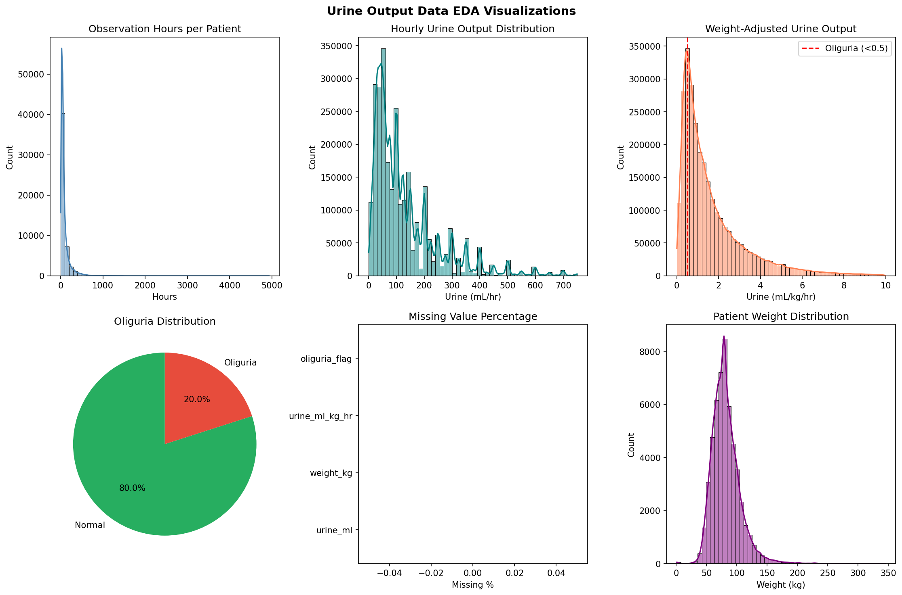

# MIMIC-IV Urine Output Data EDA Report

**Analysis Date:** 2026-01-10 19:07:11

---

## 1. Dataset Basic Information

- **Total Records:** 2,789,391
- **Unique Patients (stay_id):** 52,740
- **Number of Features:** 7

### Column Names and Data Types

```
stay_id                    int64
charttime_h       datetime64[ns]
urine_ml                 float64
weight_kg                float64
urine_ml_kg_hr           float64
oliguria_flag              int64
is_missing                  bool
```

본 Urine 데이터는 2,789,391개의 시간별 소변량 기록으로 구성되며, 
52,740명의 ICU 환자에 대한 배뇨 정보를 포함한다.

Foley catheter가 삽입된 환자에서 주로 측정되며, 
시간당 소변량은 신기능 및 체액 상태의 중요한 지표이다.

## 2. Descriptive Statistics

### Numerical Variables

```
         urine_ml   weight_kg  urine_ml_kg_hr  oliguria_flag
count  2789391.00  2789391.00      2789391.00      2789391.0
mean       141.35       83.97            1.87            0.2
std        152.66       24.99            5.41            0.4
min          0.30        1.00            0.00            0.0
25%         50.00       68.00            0.58            0.0
50%        100.00       80.00            1.14            0.0
75%        180.00       95.80            2.24            0.0
max       9900.00      345.00         1600.00            1.0
```

주요 지표 해석:
- **urine_ml**: 시간당 소변량 (mL)
- **urine_ml_kg_hr**: 체중 보정 소변량 (mL/kg/hr)
  - 정상: 0.5-1.0 mL/kg/hr
  - 핍뇨 (Oliguria): <0.5 mL/kg/hr
- **oliguria_flag**: 핍뇨 여부 (1=핍뇨)

## 3. Missing Values Analysis

| Column | Missing Count | Percentage |
|--------|---------------|------------|
| urine_ml | 0 | 0.00% |
| weight_kg | 0 | 0.00% |
| urine_ml_kg_hr | 0 | 0.00% |
| oliguria_flag | 0 | 0.00% |

### 결측 패턴 해석

Urine 데이터의 결측은 주로 다음 원인에 기인한다:

1. **Foley catheter 미삽입**: 모든 ICU 환자가 유치도뇨관을 가지고 있지 않음
2. **측정 누락**: 간헐적 측정 또는 기록 누락

소변량 결측은 "측정 불가" 상태를 의미하므로,
Median imputation이 적절하며, 결측 자체를 별도 feature로 활용하지 않는다.

## 4. Temporal Coverage Analysis

### 환자별 Urine 데이터 시간 범위

- **평균 관찰 시간:** 89.1시간
- **중앙값 관찰 시간:** 48.0시간

### 24시간 미만 데이터 보유 환자

- **해당 환자 수:** 7,764명 (14.7%)
- Foley catheter 조기 제거 또는 단기 ICU 체류로 인한 것으로 추정

## 5. Oliguria (핍뇨) Analysis

### 정의
- **Oliguria**: urine_ml_kg_hr < 0.5 mL/kg/hr

### 통계
- **전체 핍뇨 기록:** 559,239건 (20.05%)
- 핍뇨는 급성 신손상(AKI)의 조기 지표로, 중요한 예측 feature

### 임상적 의의

핍뇨는 다음 상태를 시사할 수 있다:
- 저혈량증 (Hypovolemia)
- 급성 신손상 (Acute Kidney Injury)
- 패혈성 쇼크 (Septic Shock)
- 심부전 (Heart Failure)

## 6. Clinical Reference

| 상태 | urine_ml_kg_hr | 임상적 의미 |
|------|----------------|------------|
| 정상 | >1.0 | 적절한 신관류 |
| 경계 | 0.5-1.0 | 모니터링 필요 |
| 핍뇨 | <0.5 | 신기능 저하 의심 |
| 무뇨 | <0.1 | 급성 신부전 |

## 7. Preprocessing Recommendations

### 전처리 전략

| 변수 | 권장 전략 | 근거 |
|------|----------|------|
| urine_ml | 6시간 합산 (urine_ml_6h) | 관찰 윈도우에 맞춤 |
| urine_ml_kg_hr | 6시간 평균 | 체중 보정 지표 |
| oliguria_flag | 6시간 내 1회라도 핍뇨 시 1 | 보수적 판단 |
| weight_kg | 환자별 고정값 사용 | 시간에 따른 변화 무시 |

### 슬라이딩 윈도우 적용 시 고려사항

1. **6시간 집계**: 관찰 윈도우(6h)에 맞춰 소변량 합산
2. **체중 보정**: 환자별 체중으로 정규화하여 비교 가능성 확보
3. **핍뇨 플래그**: 윈도우 내 핍뇨 발생 여부를 이진 feature로

## 8. Key Visualizations



---

## 9. Conclusion

소변량은 ICU 환자의 신기능과 체액 상태를 반영하는 중요한 생리 지표이다.

전처리 시 다음 사항을 고려해야 한다:
- 6시간 단위 집계로 관찰 윈도우에 맞춤
- 체중 보정 소변량(urine_ml_kg_hr)이 더 표준화된 지표
- 핍뇨(oliguria_flag)는 급성 신손상의 조기 경고 신호
- Foley 미삽입 환자는 결측 처리 (Median imputation)
